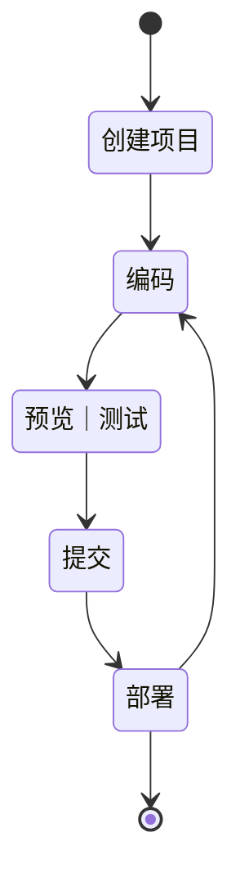

## 工程化

随着前端工作内容复杂度的增加，工程化的需求变得迫切

主要解决的问题

1. 传统语言的语法的弊端
2. 无法使用模块化/组件化
3. 重复的机械式劳动
4. 代码风格统一、质量保证
5. 依赖后端服务接口支持
6. 整体依赖后端项目

工程化的表现：一切以提高效率、降低成本、质量保证为目的的手段都属于工程化

一切的重复工作都应该被自动化

某个工具 !== 工程化

只是因为某些工具因为太强大成了工程化的代名词，工程化是一个开发策略

常见成熟的工程化集成

`create-react-app` `vue-cli` ... 

自动化构建：

- Grunt 操作文件读写 慢
- Gulp 操作内存 快