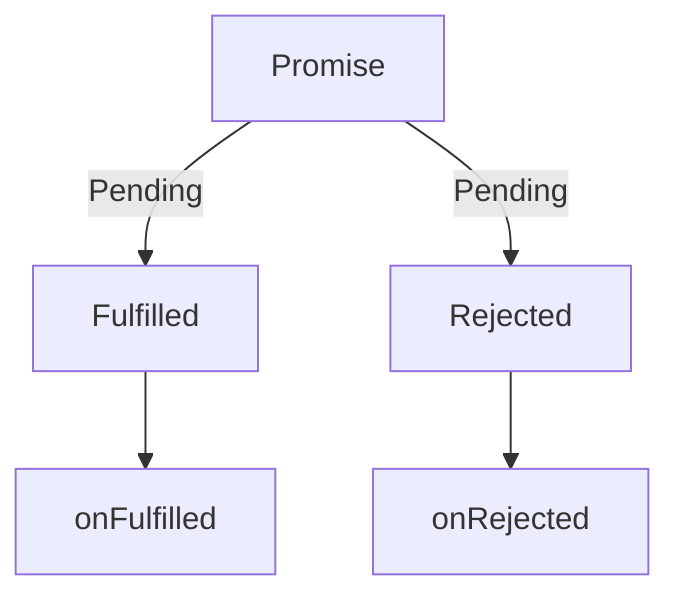

## 前置知识

JS单线程指JS执行JS代码是单线程进行

JS能够调用一些环境所提供的api，这些api是可能是异步的，如`setTimeout`

可以通过下面这个模型思考其间的关系


WebAPi中所维护的计时器和JS线程的执行屁不想干，timer1计时结束，进入Queue

- Call stack是当前js运行的调用表
- Queue是等待进入Call Stack的等待表
- 只有Call stack为空 才去查看Queue中是否有需要执行的任务，进行执行

回调函数是JS实现异步的基础

对于一个异步任务，我们不知道它会何时结束，我们于是规定它在结束的时候做什么，从而完成规定时序的效果

在计算机世界中，同步并不是指同时执行，而是在强调有执行的固定时序

并发也不是说一起运行，而是在宏观上表现为一个时间段一起运行


## Promise

Promise在回调函数的基础上进行封装，是一种更优的异步统一方案

关于Promise的状态转移图




```js
// resolve 和 reject的处理结果对应当前Promise状态的Fulfilled & Rejected
new Promise((resolve, reject) => {
  // 没有执行 resolve | reject的时候是pending
  setTimeout(() => {
    resolve(1)
  }, 200)
}).then(
  function onfulfiled(result) {
    console.log(result)
  },
  function onRejected(err) {
    console.log(err)
  }
)
```

通过then产生的回调是一种micro-task 当前call stack中的函数执行完成后，优先检查执行micro-queue中的任务

也就是说类似setTimeout所产生的回调，进入queue等待队列，想要执行，需要call stack & micro 都为空的时候，才能轮到queue

这里在思考的时候没有考虑引入generate和携程的概念，下面引入generate的时候再说


Promise还有一些特性与方法，异常穿透，链式调用，一些常用的静态方法all race ...

这些尝试写一遍源码就行了

## 生成器函数 Generate

语法

```js
function* foo(){pass}
```

特点是程序的执行是可以中断的，这里所谓的中断，就是交出主线程的控制权(JS是单线程的)

这里引入协程的概念

**生成器(Generator)函数的底层机制——协程(Coroutine)**

> **协程是一种比线程更加轻量级的存在**。你可以把协程看成是跑在线程上的任务，一个线程上可以存在多个协程，但是在线程上同时只能执行一个协程，比如当前执行的是 A 协程，要启动 B 协程，那么 A 协程就需要将主线程的控制权交给 B 协程，这就体现在 A 协程暂停执行，B 协程恢复执行；同样，也可以从 B 协程中启动 A 协程。通常，**如果从 A 协程启动 B 协程，我们就把 A 协程称为 B 协程的父协程**。
>
> 正如一个进程可以拥有多个线程一样，一个线程也可以拥有多个协程。最重要的是，协程不是被操作系统内核所管理，而完全是由程序所控制（也就是在用户态执行）。这样带来的好处就是性能得到了很大的提升，不会像线程切换那样消耗资源。

更多的操作和语法细节看代码

```js
function* foo() {
  console.log('start')
  // yield 'foo'
  let res = yield 'foo'
  console.log(`res: ${res}`)
  console.log('end')
  return undefined
}

const p = foo()
console.log(p)
// foo {<suspended>}

// 函数没有执行，只是返回了一个能够操作函数运行的指针

console.log(p.next())
// start
// {value: "foo", done: false}

// 函数开始执行 返回第一个yield后面的表达式

console.log(
  p.next(1)
)
// res: 1
// end
// {value: undefined, done: true}

// 参数传给刚刚停在位置的yield表达式
// 程序接着执行
// 因为下面没有yield 可以等价想为结尾有一个
// return undefined


console.log('***************')

function* gen() {
  yield 123 + 456;
}

const g = gen()
console.log(
  g.next(),
  g.next()
)
// {value: 579, done: false} {value: undefined, done: true}

function* f() {
  console.log('start')
  try {
    console.log(1)
    yield null
    console.log(2)
  } catch (err) {
    console.log(err)
  }
}

const err = f()
err.next()
// start
// 1
// 还可以通过拿到的generate向函数内部抛出异常
err.throw(new Error('Generator error'))
// 相当于让所停在的yield抛出异常,特殊的next
```

实现co(generate & promise搭配使用)

```js
function ajax(url) {
  return new Promise((resolve, reject) => {
    const xhr = new XMLHttpRequest()
    xhr.open('GET', url)
    xhr.responseType = 'json'
    xhr.onload = () => {
      if (xhr.status === 200) {
        resolve(xhr.response)
      } else {
        reject(new Error(xhr.statusText))
      }
    }
    xhr.send()
  })
}

function* main() {
  const users = yield ajax('/api/users.json')
  console.log(users)

  const posts = yield ajax('/api/posts.json')
  console.log(posts)

  const urls = yield ajax('/api/urls.json')
  console.log(urls)
}

const g = main()

const result = g.next()
result.value.then(
  res => {
    const result = g.next(res)
    result.value.then(
      res => {
        const result = g.next(res)
        result.value.then(
          res => {
            const result = g.next(res)
            console.log(result)
            // {value: undefined, done: true}
          }
        )
      }
    )
  }
)
// 可见这是个递归调用的过程，进行抽象

function co(generator) {
  const g = generator()

  function handleResult(result) {
    if (result.done) return // 生成器函数结束
    result.value.then(data => {
      handleResult(g.next(data))
    }, error => {
      g.throw(error)
    })
  }

  handleResult(g.next())
}

co(main)

// 还有一个比较好玩，注意看这个文件的结果，成对出现
```

## async

这个就很容易了，其实就是在规范层面对generate & Promise的搭配使用套了一层语法糖

```js
async function main() {
  const users = awaaw ajax('/api/users.json')
  console.log(users)

  const posts = yield ajax('/api/posts.json')
  console.log(posts)

  const urls = yield ajax('/api/urls.json')
  console.log(urls)
}
```

