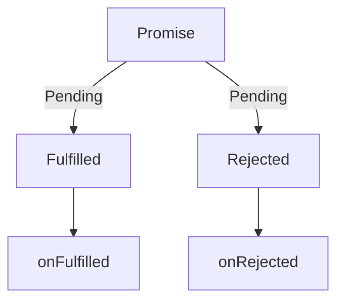

## 前置知识

JS单线程指JS执行JS代码是单线程进行

JS能够调用一些环境所提供的api，这些api是可能是异步的，如`setTimeout`

可以通过下面这个模型思考其间的关系


WebAPi中所维护的计时器和JS线程的执行屁不想干，timer1计时结束，进入Queue

- Call stack是当前js运行的调用表
- Queue是等待进入Call Stack的等待表
- 只有Call stack为空 才去查看Queue中是否有需要执行的任务，进行执行

回调函数是JS实现异步的基础

对于一个异步任务，我们不知道它会何时结束，我们于是规定它在结束的时候做什么，从而完成规定时序的效果

在计算机世界中，同步并不是指同时执行，而是在强调有执行的固定时序

并发也不是说一起运行，而是在宏观上表现为一个时间段一起运行


## Promise

Promise在回调函数的基础上进行封装，是一种更优的异步统一方案

关于Promise的状态转移图




```js
// resolve 和 reject的处理结果对应当前Promise状态的Fulfilled & Rejected
new Promise((resolve, reject) => {
  // 没有执行 resolve | reject的时候是pending
  setTimeout(() => {
    resolve(1)
  }, 200)
}).then(
  function onfulfiled(result) {
    console.log(result)
  },
  function onRejected(err) {
    console.log(err)
  }
)
```


